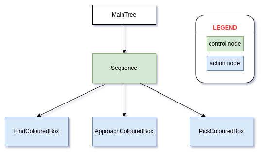
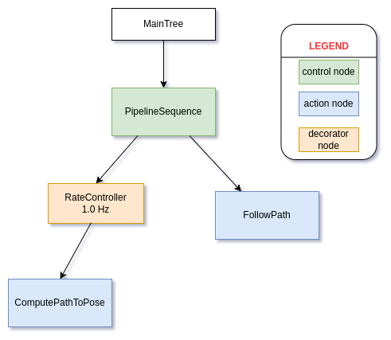

# picking coloured boxes:
The following gif shows the fast-forwarded video of sandwich bot picking up red boxes scattered around the floor.


The following diagram shows behaviour tree for coloured box picking task:



The following diagram shows behaviour tree used for navigation:



### Tools/Algorithms/tech-stack used for creating this demo:
- igntion-gazebo fortress, ros2, rviz2.
- [slam_toolbox](https://github.com/SteveMacenski/slam_toolbox) for autonomous localisation and mapping using 2D lidar data.
- [nav2](https://navigation.ros.org/getting_started/index.html) tech stack which provides following features:
  - path planner: [nav2_theta_star_planner](https://github.com/ros-planning/navigation2/tree/main/nav2_theta_star_planner).
  - path following Controller: [Regulated-Pure-Pursuit-Controller](https://github.com/ros-planning/navigation2/tree/main/nav2_regulated_pure_pursuit_controller)
  - [behaviour trees templates](https://github.com/ros-planning/navigation2/tree/main/nav2_behavior_tree).
- [rrt_exploration](https://github.com/hasauino/rrt_exploration) algorithm for autonomous exploration.
- lidar-camera sensor fusion for locating position of coloured boxes.

<br />

### Instructions to run the demo:
- build/install ROS2 foxy, rosdep, colcon and cyclonedds.
- build/install ignition-gazebo fortress version.
- Run following commands:
  ```zsh
  mkdir -p ~/ros2_ws/src
  cd ~/ros2_ws
  git clone git@github.com:TW-Gazebo/sandwich_bot_2.0-ros2.git ./src/sandwich_bot_2_0 -b demo
  source /opt/ros/foxy/setup.zsh
  rosdep install -y -r -q --from-paths src --ignore-src --rosdistro foxy -y
  colcon build --packages-up-to sandwich_bot_2_0_desktop
  source ./install/setup.zsh
  # switch middleware to cyclone dds using the following env variable.
  export RMW_IMPLEMENTATION=rmw_cyclonedds_cpp
  # launch all components
  ros2 launch sandwich_bot_2_0_desktop box_picking_start.launch.py use_sim_time:=True
  ```
- open second terminal. spawn coloured boxes in ignition gazebo.
  ```zsh
  # box locations can be changed by changing configuration in `sandwich_bot_2_0_ign_simulation/config/shapes_spawner.yaml`. First argument to the script is world name in gazebo.
  ros2 run sandwich_bot_2_0_ign_simulation shapes_spawner.py house_modified
  ```
- publish boundry points of the area to explore.
  ```zsh
  ros2 run sandwich_bot_2_0_control boundary_publisher.py
  ```
- Now you should be able to see the rrt-tree emerging from the bot location !


## References:

- rrt_exploration algorithm: https://github.com/hasauino/rrt_exploration
- MeanShift algorithm: https://github.com/mattnedrich/MeanShift_cpp/blob/master/MeanShift.cpp
- Geometry of Image Formation: https://learnopencv.com/geometry-of-image-formation/