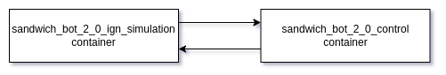

Dockerisation can be useful in case you want to train the bot using, for example reinforcement learning algorithm, on remote server.
### List of containers:
  - sandwich_bot_2_0_ign_simulation:
    - uses nvidia-docker for using nvidia gpu for efficient simulation
    - spawns the sandwich bot inside gazebo and a bunch of message bridges for sensors and controllers.
  - sandwich_bot_2_0_control:
    - contains ros codebase used for controlling the bot.
### Containers interaction:



### steps to build and launch containers:
- install docker and nvidia-docker
- Run the following commands

    ```zsh
    mkdir -p ~/workspace
    cd ~/workspace
    git clone git@github.com:TW-Gazebo/sandwich_bot_2.0-ros2.git ./sandwich_bot_2_0 -b demo
    cd sandwich_bot_2_0
    # build containers:
    docker build . -f docker/sandwich_bot_2_0_ign_simulation/Dockerfile -t sandwich_bot_2_0_ign_simulation:0.0.1

    docker build . -f docker/sandwich_bot_2_0_control/Dockerfile -t sandwich_bot_2_0_control:0.0.1 

    # spawn containers:
    docker-compose up --remove-orphans
    ```

### Note:
- gui components are disabled in docker containers
